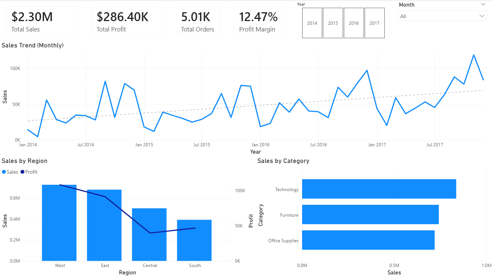
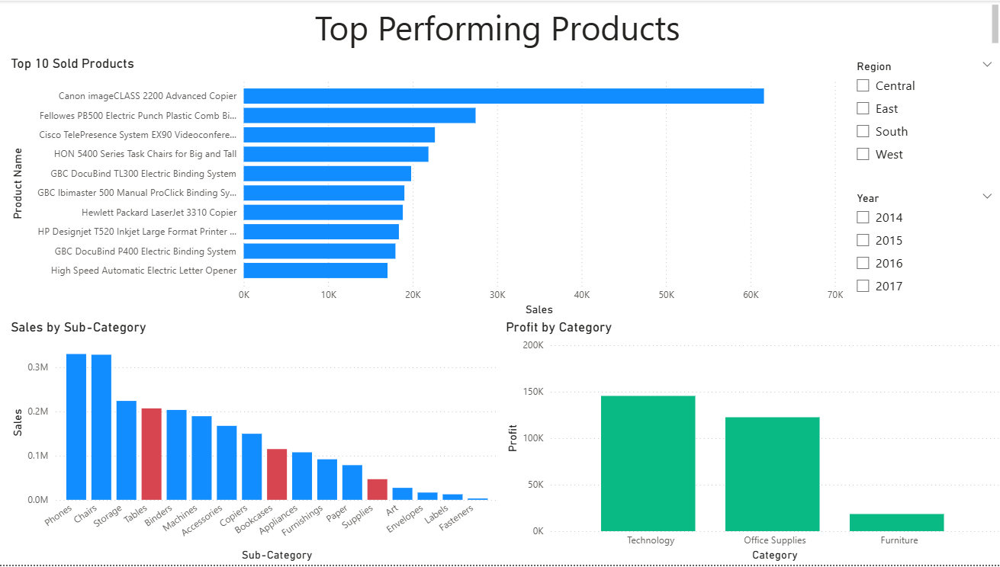
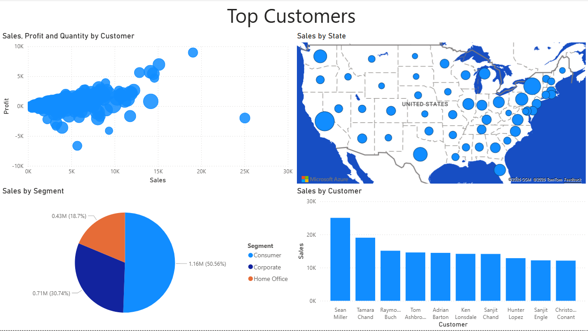

# 📊 Superstore Sales Dashboard (Power BI)

## 🧠 Overview

This project analyzes Superstore sales data to identify key revenue drivers, profitability, and regional performance.
The goal was to transform raw transactional data into a structured data model and build an interactive dashboard for business insights.

---

## ⚙️ Data Preparation & Modeling

### Data Cleaning

* Removed duplicates and handled missing values
* Excluded rows with insufficient data
* Dropped irrelevant columns to improve clarity and performance

### Data Modeling

The original dataset was a flat table. It was transformed into a **star schema**:

* **FactOrders** – transactional data
* **DimDate** – date attributes
* **DimCustomer** – customer details
* **DimRegion** – geographic data
* **DimProduct** – product hierarchy

Relationships were established between fact and dimension tables to enable efficient filtering and aggregation.

---

## 🧮 Measures (DAX)

A dedicated measures table was created, including:

* Sales
* Profit
* Profit Margin
* Orders
* Quantity
* Average Order Value
* Sales YTD
* Sales Last Year
* YoY %

---

## 📊 Dashboard Structure

The report consists of three pages:

### 1. Overview

* Key KPIs (Sales, Profit, Orders, Profit Margin)
* Sales trend over time
* Sales breakdown by region and category

### 2. Product Analysis

* Top-performing products
* Sales by sub-category
* Profitability by category

### 3. Customer & Regional Analysis

* Customer-level sales and profit distribution
* Geographic sales distribution
* Sales by segment

---

## 🔍 Key Insights

* Sales and profit show consistent year-over-year growth  
* The Central region has significantly lower profit despite comparable sales to other regions  
* Furniture has the lowest profit margin among all categories  
* Technology is the most profitable category  
* Tables, Bookcases, and Supplies generate negative profit despite strong sales

* Technology category generates the highest profitability
* Some categories show high sales but lower margins
* Sales performance varies across regions

---

## 🛠 Tools & Technologies

* Power BI (DAX, Power Query)
* Data modeling (star schema design)

---

## 📸 Screenshots

### Overview

### Product Analysis

### Customer & Regional Analysis

---

## 📁 Files

* `Superstore.pbix` – full interactive Power BI report

---

## 📌 Notes

* The dataset used is publicly available (Superstore dataset)
* Dashboard interactions allow filtering via chart selections
